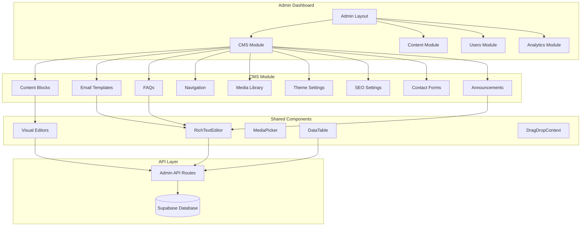
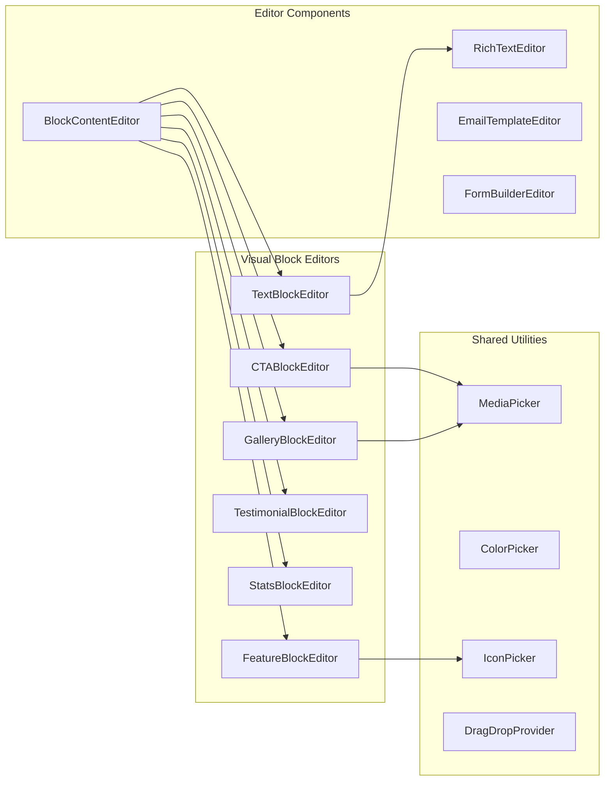

# Design Document: CMS Enhancement Audit

## Overview

This design document outlines the comprehensive enhancement of the NeuroElemental platform's Content Management System (CMS). The enhancements focus on standardizing the WYSIWYG editor usage, creating visual editors for content blocks, improving admin panel consistency, and adding advanced content management features like revision history, scheduling, and drag-and-drop ordering.

The design leverages existing patterns found in the codebase:

- TipTap-based `RichTextEditor` component for rich text editing
- `DataTable` component for standardized list views with search, filters, pagination
- `AdminPageShell`/`AdminPageHeader` for consistent admin page layouts
- Dialog-based forms for simple CRUD operations
- Full-page editors for complex content types

## Architecture

### High-Level Architecture



### Component Architecture



## Components and Interfaces

### 1. BlockContentEditor Component

A visual editor that renders type-specific forms for content blocks instead of raw JSON.

```typescript
interface BlockContentEditorProps {
  blockType: BlockType;
  content: Record<string, unknown>;
  onChange: (content: Record<string, unknown>) => void;
}

type BlockType =
  | "text"
  | "html"
  | "cta"
  | "feature"
  | "testimonial"
  | "stats"
  | "gallery"
  | "video"
  | "code"
  | "custom";

// Block-specific content schemas
interface TextBlockContent {
  body: string; // HTML from RichTextEditor
}

interface CTABlockContent {
  title: string;
  description: string;
  buttonText: string;
  buttonUrl: string;
  buttonVariant: "primary" | "secondary" | "outline";
  backgroundImage?: string;
}

interface FeatureBlockContent {
  icon: string;
  title: string;
  description: string;
  link?: string;
  linkText?: string;
}

interface TestimonialBlockContent {
  quote: string; // HTML from RichTextEditor
  authorName: string;
  authorRole: string;
  authorAvatar?: string;
  rating?: number;
}

interface StatsBlockContent {
  items: Array<{
    value: string;
    label: string;
    prefix?: string;
    suffix?: string;
  }>;
}

interface GalleryBlockContent {
  images: Array<{
    url: string;
    alt: string;
    caption?: string;
  }>;
  columns: 2 | 3 | 4;
  gap: "sm" | "md" | "lg";
}
```

### 2. EmailTemplateEditor Component

A visual editor for email templates with variable insertion and preview.

```typescript
interface EmailTemplateEditorProps {
  template: EmailTemplate;
  onChange: (template: Partial<EmailTemplate>) => void;
  onPreview: () => void;
  onSendTest: (email: string) => void;
}

interface EmailTemplate {
  id: string;
  name: string;
  slug: string;
  subject: string;
  html_content: string;
  text_content: string | null;
  variables: string[];
  category: "transactional" | "marketing" | "notification" | "system";
  is_active: boolean;
}

// Variable insertion helper
interface VariableInserterProps {
  variables: string[];
  onInsert: (variable: string) => void;
}
```

### 3. TestimonialForm Component

Complete CRUD form for testimonials with RichTextEditor for quotes.

```typescript
interface TestimonialFormProps {
  testimonial?: Testimonial;
  onSubmit: (data: TestimonialFormData) => Promise<void>;
  onCancel: () => void;
}

interface TestimonialFormData {
  name: string;
  role: string | null;
  quote: string; // HTML from RichTextEditor
  element: ElementType | null;
  avatar_url: string | null;
  is_published: boolean;
  is_verified: boolean;
  display_order: number;
}

type ElementType = "Electric" | "Fire" | "Water" | "Earth" | "Air" | "Metal";
```

### 4. DragDropList Component

Reusable drag-and-drop list for reordering content items.

```typescript
interface DragDropListProps<T> {
  items: T[];
  keyField: keyof T;
  onReorder: (items: T[]) => void;
  renderItem: (
    item: T,
    index: number,
    dragHandleProps: DragHandleProps
  ) => React.ReactNode;
  disabled?: boolean;
}

interface DragHandleProps {
  "data-drag-handle": boolean;
  onMouseDown: (e: React.MouseEvent) => void;
  onTouchStart: (e: React.TouchEvent) => void;
  style: React.CSSProperties;
}
```

### 5. ContentRevisionHistory Component

Display and manage content revision history.

```typescript
interface ContentRevisionHistoryProps {
  entityType: string;
  entityId: string;
  onRestore: (revisionId: string) => Promise<void>;
}

interface ContentRevision {
  id: string;
  entity_type: string;
  entity_id: string;
  content_snapshot: Record<string, unknown>;
  changed_fields: string[];
  created_by: string;
  created_at: string;
  user?: {
    full_name: string;
    avatar_url: string | null;
  };
}
```

### 6. ContentScheduler Component

Schedule content publication for future dates.

```typescript
interface ContentSchedulerProps {
  currentStatus: "draft" | "published" | "scheduled";
  scheduledAt: string | null;
  onSchedule: (date: Date) => void;
  onPublishNow: () => void;
  onUnpublish: () => void;
}
```

### 7. FormBuilder Component

Visual form builder with drag-and-drop field ordering.

```typescript
interface FormBuilderProps {
  fields: FormField[];
  onChange: (fields: FormField[]) => void;
}

interface FormField {
  id: string;
  name: string;
  label: string;
  type:
    | "text"
    | "email"
    | "textarea"
    | "select"
    | "checkbox"
    | "radio"
    | "number"
    | "date";
  placeholder?: string;
  required: boolean;
  validation?: ValidationRule[];
  options?: Array<{ label: string; value: string }>; // For select, checkbox, radio
}

interface ValidationRule {
  type: "minLength" | "maxLength" | "pattern" | "min" | "max";
  value: string | number;
  message: string;
}
```

## Data Models

### Content Revisions Table

```sql
CREATE TABLE content_revisions (
  id UUID PRIMARY KEY DEFAULT gen_random_uuid(),
  entity_type VARCHAR(50) NOT NULL, -- 'blog_post', 'faq', 'course', etc.
  entity_id UUID NOT NULL,
  content_snapshot JSONB NOT NULL,
  changed_fields TEXT[] DEFAULT '{}',
  created_by UUID REFERENCES auth.users(id),
  created_at TIMESTAMPTZ DEFAULT NOW(),

  -- Index for efficient lookups
  CONSTRAINT idx_revisions_entity UNIQUE (entity_type, entity_id, created_at)
);

CREATE INDEX idx_revisions_lookup ON content_revisions(entity_type, entity_id);
CREATE INDEX idx_revisions_user ON content_revisions(created_by);
```

### Scheduled Content Table

```sql
CREATE TABLE scheduled_content (
  id UUID PRIMARY KEY DEFAULT gen_random_uuid(),
  entity_type VARCHAR(50) NOT NULL,
  entity_id UUID NOT NULL,
  scheduled_at TIMESTAMPTZ NOT NULL,
  action VARCHAR(20) NOT NULL DEFAULT 'publish', -- 'publish', 'unpublish'
  status VARCHAR(20) NOT NULL DEFAULT 'pending', -- 'pending', 'completed', 'cancelled'
  created_by UUID REFERENCES auth.users(id),
  created_at TIMESTAMPTZ DEFAULT NOW(),
  completed_at TIMESTAMPTZ,

  CONSTRAINT idx_scheduled_entity UNIQUE (entity_type, entity_id, scheduled_at)
);

CREATE INDEX idx_scheduled_pending ON scheduled_content(scheduled_at) WHERE status = 'pending';
```

### Enhanced Testimonials Table

```sql
-- Testimonials table already exists, ensure these columns are present
ALTER TABLE testimonials ADD COLUMN IF NOT EXISTS quote_html TEXT;
ALTER TABLE testimonials ADD COLUMN IF NOT EXISTS is_verified BOOLEAN DEFAULT false;
ALTER TABLE testimonials ADD COLUMN IF NOT EXISTS source VARCHAR(100); -- 'manual', 'review', 'import'
ALTER TABLE testimonials ADD COLUMN IF NOT EXISTS source_url TEXT;
ALTER TABLE testimonials ADD COLUMN IF NOT EXISTS rating INTEGER CHECK (rating >= 1 AND rating <= 5);
```

### Form Fields Table Enhancement

```sql
-- Enhance contact_form_fields for visual builder
ALTER TABLE contact_form_fields ADD COLUMN IF NOT EXISTS validation_rules JSONB DEFAULT '[]';
ALTER TABLE contact_form_fields ADD COLUMN IF NOT EXISTS conditional_logic JSONB;
ALTER TABLE contact_form_fields ADD COLUMN IF NOT EXISTS width VARCHAR(20) DEFAULT 'full'; -- 'full', 'half', 'third'
```

## Correctness Properties

_A property is a characteristic or behavior that should hold true across all valid executions of a system-essentially, a formal statement about what the system should do. Properties serve as the bridge between human-readable specifications and machine-verifiable correctness guarantees._

Based on the prework analysis, the following correctness properties have been identified:

### Property 1: HTML Sanitization Preserves Safe Content

_For any_ HTML content input to the RichTextEditor, when sanitized using DOMPurify, the output SHALL NOT contain script tags, event handlers, or other XSS vectors, while preserving safe formatting elements (bold, italic, links, headings).

**Validates: Requirements 1.5**

### Property 2: Visual-JSON Editor Round Trip Consistency

_For any_ valid content block data, converting from visual editor format to JSON and back to visual editor format SHALL produce equivalent content with no data loss.

**Validates: Requirements 2.7**

### Property 3: Block Type Editor Mapping

_For any_ content block type in ['text', 'html', 'cta', 'feature', 'testimonial', 'stats', 'gallery'], the BlockContentEditor component SHALL render the corresponding type-specific editor form.

**Validates: Requirements 2.1, 2.2, 2.3, 2.4, 2.5, 2.6**

### Property 4: Drag-Drop Reorder Persistence

_For any_ ordered list of items (navigation items, FAQs, testimonials, modules, lessons), when items are reordered via drag-and-drop, the system SHALL update all affected display_order values such that the new order is persisted and reflected in subsequent queries.

**Validates: Requirements 3.4, 11.2, 11.4, 11.5**

### Property 5: Filter Results Subset

_For any_ content list with applied filters, the filtered results SHALL be a subset of the unfiltered results, and every item in the filtered results SHALL match all active filter criteria.

**Validates: Requirements 3.5, 7.5**

### Property 6: Email Template Variable Substitution

_For any_ email template with defined variables and a complete set of sample data, the preview render SHALL replace all variable placeholders with their corresponding values, leaving no unsubstituted placeholders.

**Validates: Requirements 4.3**

### Property 7: HTML to Plain Text Conversion

_For any_ HTML email content, the auto-generated plain text version SHALL contain all readable text content from the HTML, with formatting tags removed and links preserved as URLs.

**Validates: Requirements 4.4**

### Property 8: DataTable Standard Columns

_For any_ admin content list page using DataTable, the table SHALL include columns for status indicator, created/updated date, and row actions menu.

**Validates: Requirements 5.1**

### Property 9: Search Filter Correctness

_For any_ search query on a content list, every item in the results SHALL contain the search term in at least one of the searchable columns.

**Validates: Requirements 5.4**

### Property 10: Export Format Validity

_For any_ content export operation, the exported CSV SHALL be parseable as valid CSV with headers matching column names, and exported JSON SHALL be parseable as valid JSON array.

**Validates: Requirements 5.5**

### Property 11: Media Insertion HTML Correctness

_For any_ media item selected from the media library and inserted into the RichTextEditor, the generated HTML SHALL include the correct src attribute, alt text, and appropriate wrapper elements.

**Validates: Requirements 7.2**

### Property 12: Revision Creation on Save

_For any_ content save operation on a revision-tracked entity, the system SHALL create a new revision record containing the complete content snapshot, timestamp, and user ID.

**Validates: Requirements 8.1**

### Property 13: Revision Restore Creates New Revision

_For any_ revision restore operation, the system SHALL update the current content to match the restored revision AND create a new revision record documenting the restore action.

**Validates: Requirements 8.4**

### Property 14: Revision Limit Enforcement

_For any_ entity with more than 50 revisions, the system SHALL archive revisions beyond the 50 most recent, ensuring exactly 50 revisions remain accessible in the primary revision list.

**Validates: Requirements 8.5**

### Property 15: SEO Fields on Publishable Content

_For any_ content type that can be published (blog posts, courses, events, pages), the edit form SHALL include SEO fields for meta title, meta description, and social image.

**Validates: Requirements 10.1**

### Property 16: SEO Auto-Generation

_For any_ publishable content with empty SEO fields, the system SHALL auto-generate meta title from the content title and meta description from the first 160 characters of the content excerpt or description.

**Validates: Requirements 10.2**

### Property 17: Meta Description Length Warning

_For any_ meta description input exceeding 160 characters, the system SHALL display a visual warning indicator without preventing save.

**Validates: Requirements 10.5**

### Property 18: Inline Edit Save on Confirm

_For any_ inline edit operation where the user presses Enter or clicks outside the field, the system SHALL save the new value via API and update the display to reflect the saved value.

**Validates: Requirements 12.2**

### Property 19: Inline Edit Cancel on Escape

_For any_ inline edit operation where the user presses Escape, the system SHALL discard changes and restore the original value without making an API call.

**Validates: Requirements 12.3**

### Property 20: Bulk Action Selection Visibility

_For any_ content list with one or more items selected, the system SHALL display a bulk actions toolbar showing the count of selected items and available bulk operations.

**Validates: Requirements 14.1**

### Property 21: Bulk Operation Completeness

_For any_ bulk publish, unpublish, or delete operation, the system SHALL apply the operation to ALL selected items and report the count of successfully processed items.

**Validates: Requirements 14.2, 14.3, 14.4**

### Property 22: Content Duplication Naming

_For any_ content duplication operation, the duplicated item SHALL have a title equal to the original title with " (Copy)" appended, and SHALL have status set to 'draft'.

**Validates: Requirements 16.2, 16.3**

### Property 23: Course Duplication Completeness

_For any_ course duplication operation, the duplicated course SHALL include copies of all modules and lessons from the original, with preserved order and relationships.

**Validates: Requirements 16.4**

### Property 24: Duplicate Slug Uniqueness

_For any_ content duplication where the content type uses slugs, the duplicated item SHALL have a unique slug different from the original.

**Validates: Requirements 16.5**

### Property 25: Image Upload Alt Text Requirement

_For any_ image upload operation, the system SHALL require a non-empty alt text value before completing the upload.

**Validates: Requirements 20.1**

## Error Handling

### API Error Responses

All admin API endpoints follow a consistent error response format:

```typescript
interface ApiErrorResponse {
  error: string;
  code?: string;
  details?: Record<string, string[]>;
}

// HTTP Status Codes
// 400 - Bad Request (validation errors)
// 401 - Unauthorized (not logged in)
// 403 - Forbidden (insufficient permissions)
// 404 - Not Found
// 409 - Conflict (duplicate slug, etc.)
// 500 - Internal Server Error
```

### Client-Side Error Handling

```typescript
// Toast notifications for user feedback
const handleApiError = (error: ApiErrorResponse) => {
  if (error.details) {
    // Show validation errors inline
    Object.entries(error.details).forEach(([field, messages]) => {
      setFieldError(field, messages[0]);
    });
  } else {
    // Show toast for general errors
    toast({
      title: "Error",
      description: error.error,
      variant: "destructive",
    });
  }
};

// Optimistic updates with rollback
const handleOptimisticUpdate = async <T>(
  optimisticValue: T,
  apiCall: () => Promise<T>,
  rollback: () => void
) => {
  try {
    await apiCall();
  } catch (error) {
    rollback();
    handleApiError(error as ApiErrorResponse);
  }
};
```

### Revision System Error Handling

- If revision creation fails, the content save should still succeed (revision is non-critical)
- If revision restore fails, display error and do not modify current content
- If revision limit cleanup fails, log error but do not block new revision creation

## Testing Strategy

### Dual Testing Approach

This implementation uses both unit tests and property-based tests:

- **Unit tests**: Verify specific examples, edge cases, and integration points
- **Property-based tests**: Verify universal properties that should hold across all inputs

### Property-Based Testing Framework

Use **fast-check** for TypeScript property-based testing.

```typescript
import * as fc from "fast-check";

// Example: HTML Sanitization Property Test
describe("HTML Sanitization", () => {
  it("should remove XSS vectors while preserving safe content", () => {
    fc.assert(
      fc.property(
        fc.string(), // Generate random strings
        (input) => {
          const sanitized = DOMPurify.sanitize(input);
          // Property: No script tags in output
          expect(sanitized).not.toMatch(/<script/i);
          // Property: No event handlers in output
          expect(sanitized).not.toMatch(/on\w+=/i);
        }
      ),
      { numRuns: 100 }
    );
  });
});
```

### Test Categories

1. **Component Unit Tests**
   - BlockContentEditor renders correct form for each block type
   - EmailTemplateEditor variable insertion
   - DragDropList reorder callbacks
   - ContentRevisionHistory display and restore

2. **Property-Based Tests**
   - HTML sanitization (Property 1)
   - Visual-JSON round trip (Property 2)
   - Filter result correctness (Property 5)
   - Export format validity (Property 10)
   - Duplication naming (Property 22)

3. **Integration Tests**
   - Revision creation on content save
   - Bulk operations across multiple items
   - Drag-drop order persistence via API

### Test File Structure

```
__tests__/
├── properties/
│   ├── html-sanitization.property.test.ts
│   ├── visual-json-roundtrip.property.test.ts
│   ├── filter-correctness.property.test.ts
│   ├── export-validity.property.test.ts
│   └── duplication.property.test.ts
├── components/
│   ├── block-content-editor.test.tsx
│   ├── email-template-editor.test.tsx
│   ├── drag-drop-list.test.tsx
│   └── content-revision-history.test.tsx
└── api/
    ├── revisions.test.ts
    ├── bulk-operations.test.ts
    └── content-duplication.test.ts
```

### Property Test Annotations

Each property-based test must include a comment referencing the correctness property:

```typescript
/**
 * Feature: cms-enhancement-audit, Property 1: HTML Sanitization Preserves Safe Content
 * Validates: Requirements 1.5
 */
test("sanitized HTML contains no XSS vectors", () => {
  // ...
});
```
