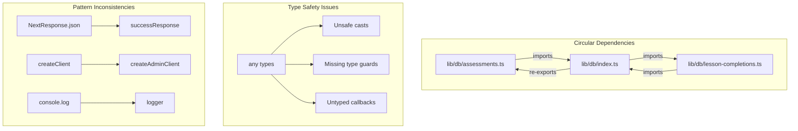
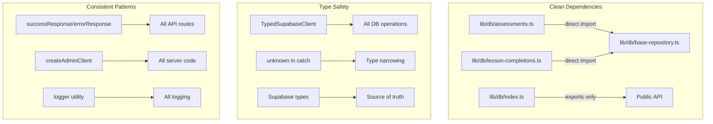
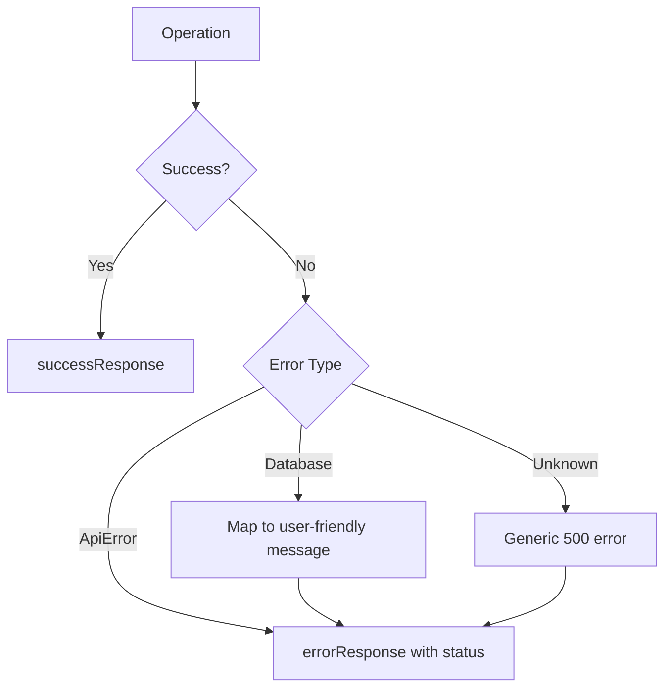

# Design Document: Codebase Technical Debt Audit

## Overview

This design document outlines the approach for systematically resolving technical debt identified in the NeuroElemental codebase. The audit revealed circular dependencies, excessive `any` type usage, unused code, inconsistent patterns, and potential type misalignments. The solution involves targeted refactoring with automated verification through property-based testing.

## Architecture

The codebase follows a Next.js App Router architecture with:

- **API Routes**: Located in `app/api/` using route handlers
- **Database Layer**: `lib/db/` with repository pattern and Supabase
- **Type System**: `lib/types/` with auto-generated and manual types
- **Utilities**: `lib/` containing shared utilities, validation, and helpers

### Current Issues Architecture



### Target Architecture



## Components and Interfaces

### 1. Circular Dependency Resolution

**Problem**: `lib/db/index.ts` creates cycles by re-exporting modules that import from it.

**Solution**:

- Use direct imports instead of barrel imports within the `lib/db/` folder
- Keep `lib/db/index.ts` as public API only, not for internal use
- Each module imports directly from source files

```typescript
// BEFORE (creates cycle)
// lib/db/assessments.ts
import { someHelper } from "./index";

// AFTER (no cycle)
// lib/db/assessments.ts
import { someHelper } from "./helpers";
```

### 2. Type Safety Improvements

**Problem**: ~40+ instances of `any` type usage reducing type safety.

**Solution Categories**:

| Pattern         | Current            | Target                           |
| --------------- | ------------------ | -------------------------------- |
| Function params | `(data: any)`      | `(data: T)` or `(data: unknown)` |
| Supabase casts  | `as { data: any }` | Use generated types              |
| Type guards     | `(obj: any)`       | `(obj: unknown)`                 |
| Callbacks       | `(...args: any[])` | Typed function signatures        |

### 3. API Response Standardization

**Problem**: Mixed usage of `NextResponse.json()` and helper functions.

**Solution**: All routes use response helpers from `lib/api/error-handler.ts`:

```typescript
// Standard patterns
import {
  successResponse,
  errorResponse,
  paginatedResponse,
} from "@/lib/api/error-handler";

// Success
return successResponse(data);

// Error
return errorResponse("Not found", 404);

// Paginated
return paginatedResponse(items, total, page, limit);
```

### 4. Supabase Client Standardization

**Problem**: Scripts use direct `createClient()` instead of standardized utilities.

**Solution**: All server-side code uses `createAdminClient()`:

```typescript
// Standard pattern
import { createAdminClient } from "@/lib/supabase/admin";

const supabase = createAdminClient();
```

### 5. Error Handling Standardization

**Problem**: Inconsistent error typing and handling patterns.

**Solution**:

```typescript
// Standard catch block
try {
  // operation
} catch (error: unknown) {
  const err = error instanceof Error ? error : new Error(String(error));
  logger.error('Context message', err);
  return { data: null, error: err.message };
}

// Unused catch parameter
} catch (_error) {
  // intentionally ignored
}
```

## Data Models

### Type Alignment Strategy

The codebase has two type sources:

1. **Auto-generated**: `lib/types/supabase.ts` - Source of truth from database
2. **Manual**: `lib/types/database.ts` - Application-level types

**Strategy**:

- Use Supabase types for database operations
- Manual types extend/compose Supabase types for application logic
- Remove duplicate definitions that drift from database schema

```typescript
// Correct pattern
import { Database } from "@/lib/types/supabase";

type Profile = Database["public"]["Tables"]["profiles"]["Row"];

// Extended type for application use
interface ProfileWithStats extends Profile {
  courseCount: number;
  completionRate: number;
}
```

## Correctness Properties

_A property is a characteristic or behavior that should hold true across all valid executions of a system-essentially, a formal statement about what the system should do. Properties serve as the bridge between human-readable specifications and machine-verifiable correctness guarantees._

### Property 1: Zero Circular Dependencies

_For any_ module in the `lib/` directory, analyzing with madge SHALL report zero circular dependencies.
**Validates: Requirements 1.1, 1.2, 1.3**

### Property 2: No `any` Type Usage

_For any_ TypeScript file in `lib/`, `app/`, or `components/`, the file SHALL contain zero instances of `: any` type annotations (excluding comments and strings).
**Validates: Requirements 2.1, 2.2, 2.3, 2.4**

### Property 3: Zero ESLint Unused Variable Warnings

_For any_ file in the codebase, running ESLint SHALL report zero `no-unused-vars` warnings.
**Validates: Requirements 3.1, 3.2, 3.3**

### Property 4: API Routes Use Response Helpers

_For any_ API route handler in `app/api/`, the handler SHALL use `successResponse()`, `errorResponse()`, or `paginatedResponse()` instead of `NextResponse.json()` directly.
**Validates: Requirements 6.1, 6.2, 6.3, 6.4**

### Property 5: Server Code Uses createAdminClient

_For any_ server-side file that creates a Supabase client, the file SHALL import and use `createAdminClient` from `@/lib/supabase/admin`.
**Validates: Requirements 7.1, 7.2, 7.3**

### Property 6: Catch Blocks Use Unknown Type

_For any_ catch block in the codebase, the error parameter SHALL be typed as `unknown` or prefixed with underscore if unused.
**Validates: Requirements 8.1, 8.4**

### Property 7: No Direct Console.log in Production Code

_For any_ file in `lib/`, `app/api/`, or `components/`, the file SHALL not contain `console.log` statements (only `console.warn` and `console.error` are allowed).
**Validates: Requirements 5.1, 5.2**

## Error Handling

### Standard Error Response Format

All API errors follow this structure:

```typescript
interface ErrorResponse {
  error: string;
  code?: string;
  details?: Record<string, unknown>;
}
```

### Error Handling Flow



## Testing Strategy

### Dual Testing Approach

The codebase uses both unit tests and property-based tests:

1. **Unit Tests**: Verify specific examples and edge cases
2. **Property-Based Tests**: Verify universal properties across all inputs

### Property-Based Testing Framework

**Library**: fast-check (already installed in the project)

**Configuration**: Each property test runs minimum 100 iterations.

### Test Organization

```
__tests__/
├── properties/
│   ├── circular-dependencies.property.test.ts
│   ├── type-safety.property.test.ts
│   ├── api-response-patterns.property.test.ts
│   ├── client-creation.property.test.ts
│   └── error-handling.property.test.ts
└── unit/
    └── (existing unit tests)
```

### Property Test Annotations

Each property-based test includes a comment referencing the design document:

```typescript
/**
 * Feature: codebase-technical-debt-audit, Property 1: Zero Circular Dependencies
 * Validates: Requirements 1.1, 1.2, 1.3
 */
```
