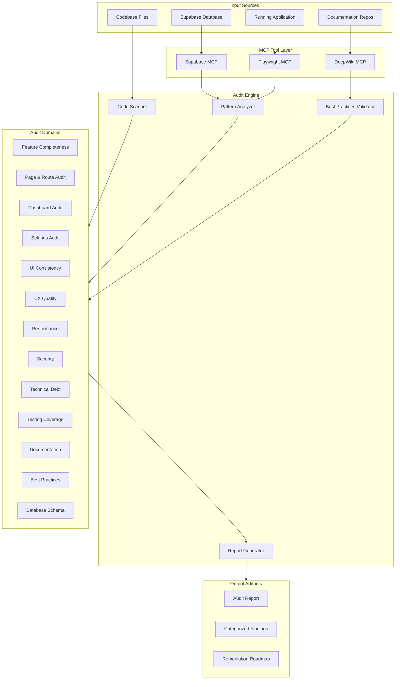

# Design Document: Comprehensive Platform Audit

## Overview

The Comprehensive Platform Audit is a systematic evaluation framework for the NeuroElemental platform. It leverages MCP tools (Supabase, Playwright, DeepWiki) to perform automated and semi-automated assessments across 14 audit domains, producing actionable findings with prioritized remediation recommendations.

The audit produces a consolidated report with health scores, categorized findings, and a remediation roadmap suitable for sprint planning.

## Architecture



## Components and Interfaces

### 1. Code Scanner Component

Responsible for static analysis of the codebase.

```typescript
interface CodeScanner {
  // Scan app directory for pages and routes
  scanPages(appDir: string): Promise<PageInventory>;

  // Scan API routes for pattern compliance
  scanApiRoutes(apiDir: string): Promise<RouteInventory>;

  // Scan components for duplication and patterns
  scanComponents(componentsDir: string): Promise<ComponentInventory>;

  // Identify orphaned/unused code
  findOrphanedCode(): Promise<OrphanedCodeReport>;
}

interface PageInventory {
  pages: PageInfo[];
  totalCount: number;
  byDomain: Record<string, PageInfo[]>;
}

interface PageInfo {
  path: string;
  routePath: string;
  hasLoadingState: boolean;
  hasErrorState: boolean;
  isProtected: boolean;
  requiredRoles: string[];
}

interface RouteInventory {
  routes: RouteInfo[];
  factoryPatternCompliance: number; // percentage
  authenticationCoverage: number; // percentage
}

interface RouteInfo {
  path: string;
  methods: ("GET" | "POST" | "PUT" | "DELETE" | "PATCH")[];
  usesFactoryPattern: boolean;
  authType: "public" | "authenticated" | "admin" | "none";
  hasValidation: boolean;
}
```

### 2. MCP Integration Layer

Interfaces for MCP tool interactions.

```typescript
interface SupabaseMCPClient {
  // List all tables in the database
  listTables(projectId: string): Promise<TableInfo[]>;

  // Execute SQL query for analysis
  executeSql(projectId: string, query: string): Promise<QueryResult>;

  // List migrations
  listMigrations(projectId: string): Promise<Migration[]>;

  // Get security advisors
  getAdvisors(
    projectId: string,
    type: "security" | "performance"
  ): Promise<Advisory[]>;
}

interface PlaywrightMCPClient {
  // Navigate to a page
  navigate(url: string): Promise<void>;

  // Take accessibility snapshot
  snapshot(): Promise<AccessibilitySnapshot>;

  // Click element
  click(element: string, ref: string): Promise<void>;

  // Fill form
  fillForm(fields: FormField[]): Promise<void>;

  // Get console messages
  getConsoleMessages(onlyErrors?: boolean): Promise<ConsoleMessage[]>;
}

interface DeepWikiMCPClient {
  // Ask question about a repository
  askQuestion(repoName: string, question: string): Promise<string>;

  // Read wiki contents
  readWikiContents(repoName: string): Promise<WikiContent>;
}
```

### 3. Audit Domain Evaluators

Each audit domain has a dedicated evaluator.

```typescript
interface AuditEvaluator<TResult> {
  // Run the evaluation
  evaluate(): Promise<TResult>;

  // Get findings from evaluation
  getFindings(): Finding[];

  // Get health score (0-100)
  getHealthScore(): number;
}

interface Finding {
  id: string;
  domain: AuditDomain;
  severity: "critical" | "high" | "medium" | "low";
  title: string;
  description: string;
  location?: string; // file path or URL
  recommendation: string;
  effortEstimate: "hours" | "days" | "weeks";
  effortValue: number;
}

type AuditDomain =
  | "features"
  | "routes"
  | "dashboards"
  | "settings"
  | "ui-consistency"
  | "ux-quality"
  | "performance"
  | "security"
  | "technical-debt"
  | "testing"
  | "documentation"
  | "best-practices"
  | "database";
```

### 4. Report Generator

Produces the final audit report.

```typescript
interface ReportGenerator {
  // Generate full audit report
  generateReport(evaluations: EvaluationResult[]): AuditReport;

  // Generate executive summary
  generateSummary(report: AuditReport): ExecutiveSummary;

  // Generate remediation roadmap
  generateRoadmap(findings: Finding[]): RemediationRoadmap;
}

interface AuditReport {
  generatedAt: Date;
  summary: ExecutiveSummary;
  domainReports: DomainReport[];
  findings: Finding[];
  roadmap: RemediationRoadmap;
}

interface ExecutiveSummary {
  overallHealthScore: number;
  domainScores: Record<AuditDomain, number>;
  criticalFindings: number;
  highFindings: number;
  mediumFindings: number;
  lowFindings: number;
  estimatedRemediationEffort: string;
}

interface RemediationRoadmap {
  sprints: SprintPlan[];
  totalEffortWeeks: number;
}

interface SprintPlan {
  sprintNumber: number;
  focus: string;
  findings: Finding[];
  estimatedEffort: string;
}
```

## Data Models

### Audit Configuration

```typescript
interface AuditConfig {
  projectId: string; // Supabase project ID
  baseUrl: string; // Application URL for Playwright
  domains: AuditDomain[]; // Which domains to audit
  thresholds: AuditThresholds;
}

interface AuditThresholds {
  // Performance thresholds
  maxLCP: number; // milliseconds
  maxFID: number; // milliseconds
  maxCLS: number; // score
  maxApiResponseTime: number; // milliseconds

  // Code quality thresholds
  minTestCoverage: number; // percentage
  maxDuplicateLines: number;

  // Security thresholds
  requireRLSOnAllTables: boolean;
  requireAuthOnApiRoutes: boolean;
}
```

### Feature Classification

```typescript
interface FeatureClassification {
  featureId: string;
  name: string;
  domain: FeatureDomain;
  status: "complete" | "partial" | "stub";
  completionPercentage: number;
  missingFunctionality?: string[];
  relatedFiles: string[];
}

type FeatureDomain =
  | "auth"
  | "lms"
  | "commerce"
  | "events"
  | "b2b"
  | "tools"
  | "admin"
  | "settings";
```

### Dashboard Evaluation

```typescript
interface DashboardEvaluation {
  role: "student" | "instructor" | "business" | "admin";
  completenessScore: number;
  navigationItems: NavigationItemStatus[];
  widgets: WidgetStatus[];
  placeholders: PlaceholderInfo[];
  permissionViolations: PermissionViolation[];
}

interface NavigationItemStatus {
  label: string;
  href: string;
  isWorking: boolean;
  error?: string;
}

interface WidgetStatus {
  name: string;
  hasRealData: boolean;
  dataSource?: string;
  isPlaceholder: boolean;
}
```

## Correctness Properties

_A property is a characteristic or behavior that should hold true across all valid executions of a system-essentially, a formal statement about what the system should do. Properties serve as the bridge between human-readable specifications and machine-verifiable correctness guarantees._

Based on the prework analysis, the following correctness properties have been identified. Properties have been consolidated to eliminate redundancy.

### Property 1: Feature Classification Completeness

_For any_ feature evaluated by the Audit_System, the classification SHALL be exactly one of: 'complete', 'partial', or 'stub', and partial features SHALL always have non-empty missing functionality documentation.
**Validates: Requirements 1.2, 1.3**

### Property 2: Coverage Percentage Validity

_For any_ domain coverage percentage produced by the Audit_System, the value SHALL be a number between 0 and 100 inclusive.
**Validates: Requirements 1.4, 10.1**

### Property 3: Route-Page Mapping Consistency

_For any_ page.tsx file in the app directory, the Audit_System SHALL produce a corresponding route path that matches Next.js App Router conventions.
**Validates: Requirements 2.1**

### Property 4: Factory Pattern Detection Accuracy

_For any_ API route file, the Audit_System SHALL correctly identify whether it imports and uses createAuthenticatedRoute, createPublicRoute, createAdminRoute, or similar factory functions.
**Validates: Requirements 2.3**

### Property 5: Authentication Flagging Consistency

_For any_ API route identified as lacking proper authentication, the Audit_System SHALL flag it as a security concern in the findings.
**Validates: Requirements 2.4, 8.3**

### Property 6: Dashboard Navigation Validity

_For any_ navigation item in a dashboard, if the Audit_System marks it as working, then navigating to that href using Playwright_MCP SHALL not produce a 404 or error page.
**Validates: Requirements 3.1**

### Property 7: Widget Data Verification

_For any_ dashboard widget marked as having real data, the displayed values SHALL match corresponding Supabase_MCP query results.
**Validates: Requirements 3.2**

### Property 8: Role-Based Access Enforcement

_For any_ dashboard and user role combination, if the role is not in the dashboard's requiredRoles list, accessing that dashboard SHALL result in a redirect or forbidden response.
**Validates: Requirements 3.3**

### Property 9: Settings Round-Trip Consistency

_For any_ setting that can be modified, reading the setting, modifying it, persisting it, and reading it again SHALL return the modified value.
**Validates: Requirements 4.1**

### Property 10: Design Token Consistency

_For any_ UI component using color, spacing, or typography values, those values SHALL reference design tokens defined in the Tailwind configuration or CSS variables.
**Validates: Requirements 5.1**

### Property 11: Duplicate Component Detection

_For any_ two components identified as duplicates by the Audit_System, they SHALL share at least 80% structural similarity in their implementation.
**Validates: Requirements 5.5**

### Property 12: Accessibility Compliance

_For any_ page evaluated for accessibility, the Audit_System SHALL report WCAG 2.1 AA violations with specific element references and remediation guidance.
**Validates: Requirements 6.4**

### Property 13: Core Web Vitals Measurement Validity

_For any_ page measured for performance, LCP SHALL be in milliseconds (positive number), FID SHALL be in milliseconds (positive number), and CLS SHALL be a score between 0 and 1.
**Validates: Requirements 7.1**

### Property 14: RLS Policy Coverage

_For any_ table in the Supabase database, the Audit_System using Supabase_MCP SHALL verify whether RLS is enabled and report tables without RLS as security findings.
**Validates: Requirements 8.2**

### Property 15: Security Severity Classification

_For any_ security vulnerability identified, the Audit_System SHALL classify it as exactly one of: 'critical', 'high', 'medium', or 'low'.
**Validates: Requirements 8.5**

### Property 16: Direct Supabase Call Detection

_For any_ file identified as having direct Supabase calls (using .from().select() pattern), the Audit_System SHALL flag it as a repository pattern violation.
**Validates: Requirements 9.1**

### Property 17: Code Duplication Threshold

_For any_ code block identified as duplicate, the block SHALL contain at least 20 lines of similar code.
**Validates: Requirements 9.4**

### Property 18: Remediation Backlog Prioritization

_For any_ finding in the remediation backlog, it SHALL have an effort estimate (hours/days/weeks with numeric value) and a priority ranking.
**Validates: Requirements 9.5, 14.4**

### Property 19: Best Practices Validation

_For any_ pattern evaluated against DeepWiki_MCP best practices, the Audit_System SHALL document whether it conforms to current recommendations for the specific framework version (Next.js 16, Tailwind 4, React 19).
**Validates: Requirements 12.1, 12.2, 12.3, 12.4**

### Property 20: Migration Synchronization

_For any_ migration listed in the supabase/migrations directory, the Audit_System using Supabase_MCP SHALL verify it has been applied to the database.
**Validates: Requirements 13.4**

### Property 21: Report Completeness

_For any_ audit report generated, it SHALL contain: an executive summary with health scores, findings categorized by domain and severity, and a remediation roadmap with sprint allocations.
**Validates: Requirements 14.1, 14.2, 14.3, 14.5**

## Error Handling

### MCP Tool Errors

```typescript
class MCPToolError extends Error {
  constructor(
    public tool: "supabase" | "playwright" | "deepwiki",
    public operation: string,
    message: string
  ) {
    super(`${tool} MCP error during ${operation}: ${message}`);
  }
}

// Retry logic for transient failures
async function withRetry<T>(
  operation: () => Promise<T>,
  maxRetries: number = 3,
  delayMs: number = 1000
): Promise<T> {
  let lastError: Error;
  for (let i = 0; i < maxRetries; i++) {
    try {
      return await operation();
    } catch (error) {
      lastError = error as Error;
      if (i < maxRetries - 1) {
        await new Promise((resolve) => setTimeout(resolve, delayMs * (i + 1)));
      }
    }
  }
  throw lastError!;
}
```

### Partial Audit Handling

If an audit domain fails, the system continues with other domains and reports partial results.

```typescript
interface AuditResult {
  status: "complete" | "partial" | "failed";
  completedDomains: AuditDomain[];
  failedDomains: { domain: AuditDomain; error: string }[];
  report?: AuditReport;
}
```

## Testing Strategy

### Unit Testing

Unit tests verify individual audit evaluators and utilities:

- Feature classification logic
- Route pattern detection
- Severity classification
- Report generation formatting

### Property-Based Testing

Property-based tests verify correctness properties using fast-check:

```typescript
import * as fc from "fast-check";

// Property 2: Coverage Percentage Validity
describe("Coverage Percentage Validity", () => {
  it("should always produce percentages between 0 and 100", () => {
    fc.assert(
      fc.property(
        fc.array(
          fc.record({
            status: fc.constantFrom("complete", "partial", "stub"),
          })
        ),
        (features) => {
          const coverage = calculateCoverage(features);
          return coverage >= 0 && coverage <= 100;
        }
      ),
      { numRuns: 100 }
    );
  });
});

// Property 15: Security Severity Classification
describe("Security Severity Classification", () => {
  it("should classify all vulnerabilities into exactly one severity level", () => {
    fc.assert(
      fc.property(
        fc.record({
          type: fc.string(),
          description: fc.string(),
          impact: fc.string(),
        }),
        (vulnerability) => {
          const severity = classifySeverity(vulnerability);
          return ["critical", "high", "medium", "low"].includes(severity);
        }
      ),
      { numRuns: 100 }
    );
  });
});
```

### Integration Testing

Integration tests verify MCP tool interactions:

- Supabase MCP table listing and query execution
- Playwright MCP page navigation and snapshot capture
- DeepWiki MCP question answering

### End-to-End Testing

E2E tests verify complete audit workflows:

- Full audit execution with all domains
- Report generation with real data
- Roadmap generation with prioritization
